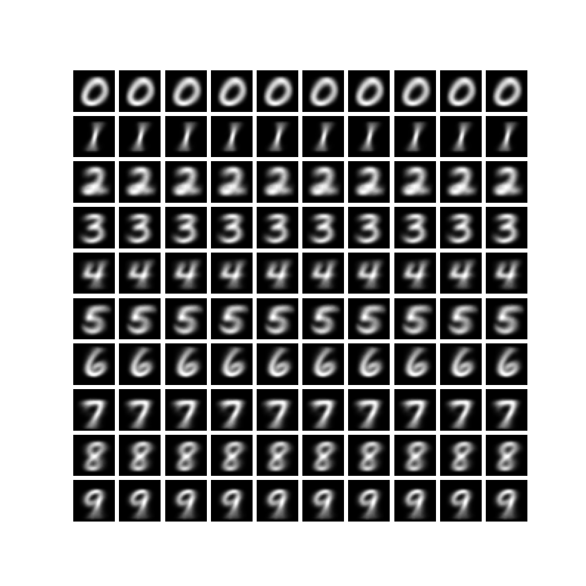
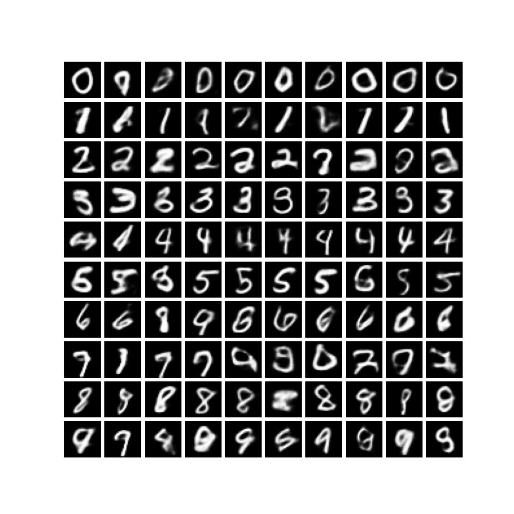

# CVAE on MINIST

#### CVAE: Conditional Variational Auto Encoder

CVAE包含编码器（Encoder）和解码器（Decoder）两个部分。

**编码器**（Encoder）通过对现有数据的分布进行统计，模拟出一组高斯分布的参数，参数指的是**均值**和**方差**。

**译码器**（Decoder）接收label和随机噪声，基于编码器模拟的高斯分布，输出图片。

对于MINIST dataset的数字0-9，统计每个数字的特征分布。例如，直接统计其原始特征是([1* 28* 28])，若使用全连接层则可以变为([256]),  若统计器卷积后的特征则可以是（[64, 28, 28]）

然后将 **特征** 和 **label** 输入到潜在空间，输出一组参数（**均值**和**方差**）用来描述特征分布。

最终将特征分布以1* 28 *28的形式输出，得到我们要的照片


## 测试不同网络结构的效果

Encoder(1 * 全连接) + Decoder(2* 全连接) => 少部分生成照片和输入的label不符

Encoder(2* 卷积 + 1 *全连接) + Decoder(2 *全连接 + 2 * 卷积) => 生成照片几乎都符合输入的label


结论：引入卷积提取特征效果比全连接层好


## 调参

确定网络结构：Encoder(2* 卷积 + 1 *全连接) + Decoder(2 *全连接 + 2 * 卷积) ，epochs=5，loss_func像素交叉熵均值：

```python
def loss_function(recon_x, x, mean, logvar):
    reconstruction_loss = F.binary_cross_entropy(recon_x, x, reduction='mean')
    kl_divergence_loss = -0.5 * torch.sum(1 + logvar - mean.pow(2) - logvar.exp())
    loss = reconstruction_loss.pow + kl_divergence_loss
    return loss
```


#### **改变batch_size**

| learning_rate | batch_size | loss   | 观察生成效果         |
| ------------- | ---------- | ------ | -------------------- |
| 0.0001        | 32         | 0.2222 | 形状符合，对比度略差 |
| 0.0001        | 64         | 0.2213 | 形状符合，对比度略差 |
| 0.0001        | 128        | 0.2213 | 形状符合，对比度略差 |

上述，loss接近，生成效果肉眼看不出区别


**固定batch_size=64，修改learning_rate**

0.001收敛

0.0001收敛，loss的收敛情况和0.001接近

0.00001，收敛很慢，数字能看出轮廓，但非常模糊


**固定batch_size=64，learning_rate=0.0001，改变loss_func**

初始的loss_func，交叉熵loss求均值

```python
def loss_function(recon_x, x, mean, logvar):
    reconstruction_loss = F.binary_cross_entropy(recon_x, x, reduction='mean')
    kl_divergence_loss = -0.5 * torch.sum(1 + logvar - mean.pow(2) - logvar.exp())
    loss = reconstruction_loss.pow + kl_divergence_loss
    return loss
```

辨识度极高，十分稳定，对比度略差




交叉熵loss 改为求sum

```python
def loss_function(recon_x, x, mean, logvar):
    reconstruction_loss = F.binary_cross_entropy(recon_x, x, reduction='sum')
    kl_divergence_loss = -0.5 * torch.sum(1 + logvar - mean.pow(2) - logvar.exp())
    loss = reconstruction_loss.pow(0.9) + kl_divergence_loss
    return loss
```

对比度增强，但数字辨识度下降




## 增强对比度

#### 改变loss权重

给像素灰度交叉熵loss更高的权重

线性权重

指数权重


#### **测试1**

交叉熵loss采用 sum的形式，然后赋予指数权重 pow（0.8）效果较好

```python
loss = reconstruction_loss.pow(0.8) + kl_divergence_loss
```

辨识度较高，对比度较高，稳定性下降

.png)

#### 测试2

loss采用mean的形式，改变交叉熵loss的权重

```python
    loss = reconstruction_loss.pow(6.0) + kl_divergence_loss
```

对比度略微增加，稳定性和辨识度下降

.png)

## 学习总结

1.CVAE在MINIST上训练的过程，可以概括为由手写数字图片特征的 **真实分布**，去拟合一个**先验分布**（这个先验分布高斯分布），然后用 真实分布, 先验分布 和 **学习分布**的差异作为loss 去训练 学习分布。

 这里有一个前提：像素的灰度值分布是随机的，满足或近似满足高斯分布。

2.本次实验的loss_func 包含 像素灰度二元交叉熵loss 和 KL散度loss

**二元交叉熵loss** 衡量 像素灰度的真实分布 和 学习分布 的差异，衡量 原始数据 和 生成数据 的 匹配程度。

**KL散度loss** 衡量 先验分布 和 学习分布 的差异，影响生成图片的正确性、稳定性。


3.调参

loss_func的定义, 作用, 含义 对于选取 合适的loss十分重要

loss_func可能由多个loss组合而成, 可以改变不同部分的权重达到预期的效果

loss权重, 目前我了解到有:

系数权重: total_loss = alpha * loss_A + beta * loss_B

幂权重（作为）: total_loss =  loss_A.pow(alpha) +  loss_B.pow(beta) 

指数权重: total_loss = exp(alpha * loss_A) + exp(beta * loss_B)

